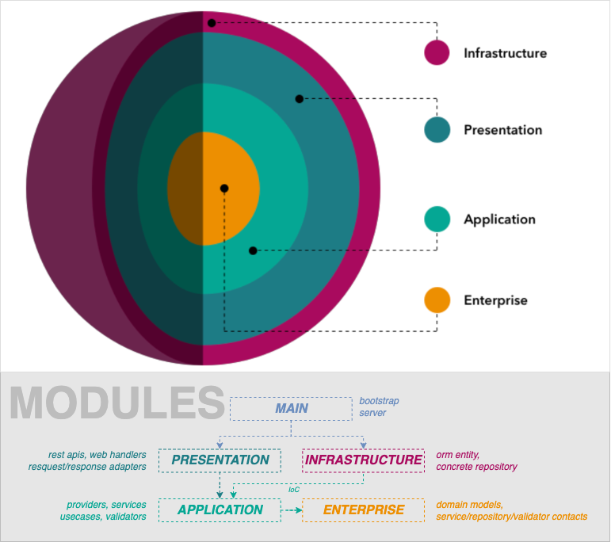
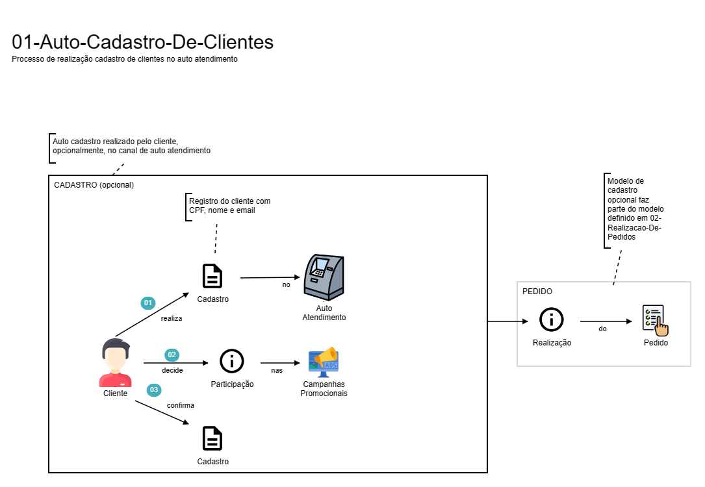
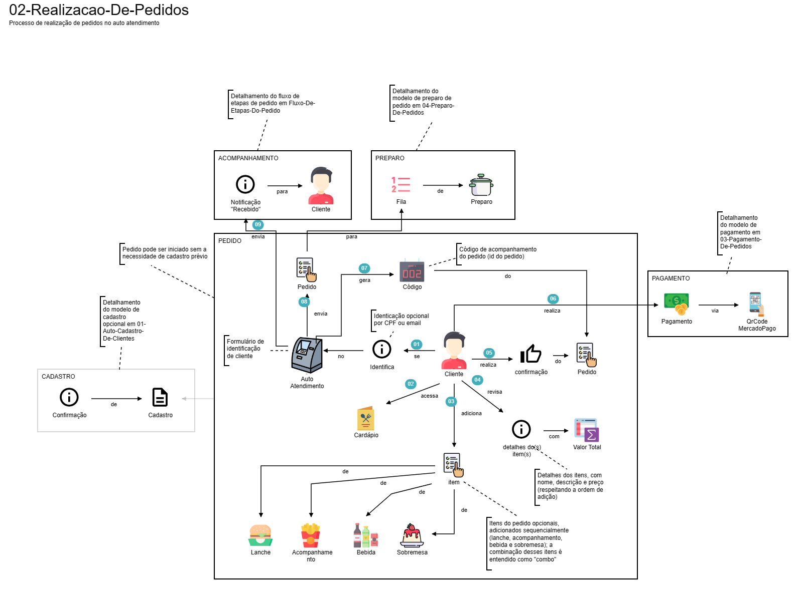
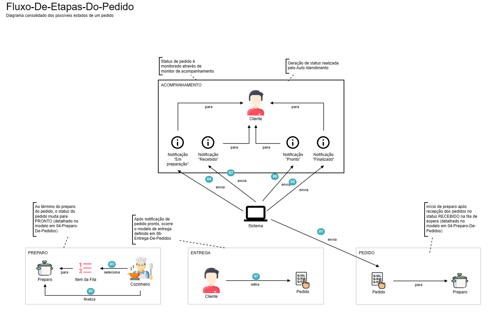

   

  

 

# 🍔 Fast & Foodious [](https://dl.circleci.com/status-badge/redirect/gh/rodrigo-ottero/fast-n-foodious/tree/main)  
Sistema de auto-atendimento de fast food. Projeto de conclusão da Fase 02 da pós gradução em Software Architecture.

* [Arquitetura](#arquitetura)
* [Instalação de Dependências Node](#-instalação-de-dependências-node)
* [Build da Aplicação](#-build-da-aplicação)
* [Executando a Aplicação](#%EF%B8%8F-executando-a-aplicação)
    * [Variáveis de Ambiente](#-variáveis-de-ambiente)
    * [Execução em modo local (in-memory repository)](#%EF%B8%8F-execução-em-modo-local-in-memory-repository)
    * [Execução em modo local (mysql repository)](#%EF%B8%8F-execução-em-modo-local-mysql-repository)
    * [**Execução em modo produção (Avaliação FIAP)**](#%EF%B8%8F-execução-em-modo-produção-avaliação-fiap)
        * [Docker Compose (Modo Fácil!)](#-docker-compose-modo-fácil)
        * [Docker (Modo Desbravador!)](#-docker-modo-desbravador)
        * [Kubernetes (Modo Fácil!)](#-kubernetes-modo-fácil)
        * [Kubernetes (Modo Desbravador!)](#-kubernetes-modo-desbravador)
    * [Documentação da API](#-documentação-da-api)
* [Testes](#-testes)
* [Estrutura Base do Projeto](#%EF%B8%8F-estrutura-base-do-projeto)
* [DDD](#ddd)
    * [Dicionário de Linguagem Ubíqua](/docs/dicionario-linguagem-ubiqua.md)
    * [Domain Storytelling](#domain-storytelling)
        * [Auto Cadastro de Clientes](#auto-cadastro-de-clientes)
        * [Realização de Pedidos](#realização-de-pedidos)
        * [Pagamento de Pedidos](#pagamento-de-pedidos)
        * [Preparo de Pedidos](#preparo-de-pedidos)
        * [Entrega de Pedidos](#entrega-de-pedidos)
        * [Fluxo de etapas dos Pedidos](#fluxo-de-etapas-dos-pedidos)

## Arquitetura


- Arquitetura Clean & Modular
    - Camada de Application, Enterprise, Presentation e Infrastructure
    - Módulo Main, Application, Enterprise, Presentation e Infrastructure
- Principais Tecnologias/Frameworks
    - Docker, NodeJS, NestJS, TypeORM, NPM, Mysql, Swagger, Typescript, Jest
- Qualidade / Testes
    - Validações pré-commit/push
        - Validação de cobertura de testes (threshold 95%)
        - Testes unitários, e2e em memória (all green)
        - Validação de implementação de testes (modo alerta para implementação de testes de controllers, services, validators, repositories)
    - CI/CD
        - Pipeline CircleCI para integração com a ```main```
            - run-unit-tests        - Execução de testes unitários (all green)
            - run-e2e-mysql         - Execução de testes e2e com mysql (all green)
            - run-e2e-in-memory     - Execução de testes e2e em memória (all green)
            - run-coverage-tests    - Execução de validação de cobertura de testes (all green)
            - run-check-test-impl   - Execução de validação de implementação de testes (implementação mandatória de testes de controllers, services, validators, repositories)
            - build-image           - Build de imagens docker e publicação no registry (publicação de imagens docker no DockerHub nas arquiteturas ADM & ARM)
            
            [](https://app.circleci.com/insights/github/rodrigo-ottero/fast-n-foodious/workflows/workflow/overview?branch=main&reporting-window=last-7-days&insights-snapshot=true)

## 🚀 Instalação de Dependências Node
```bash
$ npm install
```

## 🧩 Build da Aplicação
```bash
$ npm run build
```

## ⚡️ Executando a Aplicação
O sistema pode ser executado com ou sem dependências externas.
### 📦 Variáveis de Ambiente
`NODE_ENV` como variável de ambiente, com os seguintes valores:

```bash
# env_name:
- local                   # Variáveis usadas para rodar a aplicação em ambiente local, COM dependência de container mysql
                          # Presume mysql rodando e a necessidade de atachar a aplicação ao container para desenvolver
                          # Exemplo de caso de uso: debugar local e apontando para o banco no container.
                          # $ NODE_ENV=local npm run start:debug

- local-mock-repository   # Variáveis usadas para rodar a aplicação em ambiente local, SEM dependência de container mysql
                          # Exemplo de caso de uso: debugar local rodando com o banco em memória
                          # $ NODE_ENV=local-mock-repository npm run start:debug

- prod                    # Variáveis usadas para rodar a aplicação em ambiente de produção, COM dependøencia de container mysql
                          # $ NODE_ENV=prod npm run start:debug

# Desenvolvimento
$ NODE_ENV={env_name} npm run start

# Modo Watch
$ NODE_ENV={env_name} npm run start:dev

# Modo Debug
$ NODE_ENV={env_name} npm run start:debug

# Modo Produção
$ npm run start:prod
```
**Nota:** Se informado o env_name DIFERENTE de `local-mock-repository`, o modo de desenvolvimento, watch, debug e produção vai depender de ter um container mysql em execução.

### ⚡️ Execução em modo local (in-memory repository)
Utilizado **`apenas para desenvolvimento local, modo watch, debug, testes unitários e e2e`**. Executa a aplicação em modo local, com repositório em memória:
```
$ NODE_ENV=local-mock-repository npm run start
```

### ⚡️ Execução em modo local (mysql repository)
Utilizado **`apenas para desenvolvimento local, modo watch, debug, testes e2e `**. Inicia o contianer mysql com as variáveis locais e inicia a aplicação `(fora do container)`com as variáveis locais:
```
$ docker-compose --env-file ./envs/local.env up mysql
$ docker ps
CONTAINER ID   IMAGE       COMMAND                  CREATED         STATUS         PORTS                               NAMES
83c9b4d8880a   mysql:8.0   "docker-entrypoint.s…"   3 seconds ago   Up 2 seconds   0.0.0.0:3306->3306/tcp, 33060/tcp   mysql

# Executa a aplicação com as variáveis locais, conectando no container do mysql
$ NODE_ENV=local npm run start
```

### 🚨⚡️ Execução em modo produção (Avaliação FIAP)
Utilizado **`apenas para produção e para avaliação dos instrutores FIAP`**.

#### 🫧 Docker Compose (Modo Fácil!)
Inicia o container da aplicação e do mysql com as variáveis de produção, utilizando o docker compose:
```
$ docker-compose --env-file ./envs/prod.env up -d
$ docker ps
CONTAINER ID   IMAGE                 COMMAND                  CREATED         STATUS         PORTS                               NAMES
2a0f11e4ffe3   fast-n-foodious       "docker-entrypoint.s…"   5 seconds ago   Up 4 seconds   0.0.0.0:3000->3000/tcp              fast-n-foodious
06ebf6b90fa7   mysql:8.0             "docker-entrypoint.s…"   5 seconds ago   Up 4 seconds   0.0.0.0:3306->3306/tcp, 33060/tcp   mysql
```

#### 💀 Docker (Modo Desbravador!)
Inicia o container da aplicação e do mysql com as variáveis de produção, utilizando *`imagens docker`* do mysql e da aplicação:
```
$ docker network create fast-n-foodious-network

$ docker run -d --rm --name mysql -p 3306:3306 \
    --env-file ./envs/prod.env --network fast-n-foodious-network \
    -v ./scripts/schema:/docker-entrypoint-initdb.d \
    -v mysql-data:/data/db \
    mysql:8.0

$ docker run -d --rm --name fast-n-foodious -p 3000:3000 \
    --env-file ./envs/prod.env --network fast-n-foodious-network \
    ottero/fast-n-foodious

$ docker ps
CONTAINER ID   IMAGE                                COMMAND                  CREATED         STATUS         PORTS                               NAMES
88bf7eae7e46   ottero/fast-n-foodious               "docker-entrypoint.s…"   2 seconds ago   Up 1 second    0.0.0.0:3000->3000/tcp              fast-n-foodious
8b0268d435a6   mysql:8.0                            "docker-entrypoint.s…"   6 seconds ago   Up 5 seconds   0.0.0.0:3306->3306/tcp, 33060/tcp   mysql
```
#### 🫧 Kubernetes (Modo Fácil!)
//TODO documentar deploy cluster k8s com helm
#### 💀 Kubernetes (Modo Desbravador!)
//TODO documentar deploy cluster k8s com descriptors

### 🧾 Documentação da API (Swagger)
http://localhost:3000/api   `docker`
http://localhost:80/api     `k8s`

### 🎮 Extras Docker Compose

```bash
# Build com docker-compose utilizando env específica
$ docker-compose --env-file ./envs/{env-name}.env build

# Execução dos serviços registrados no docker-compose utilizando env específica
$ docker-compose --env-file ./envs/{env-name}.env up

# Execução de um serviço registrados no docker-compose utilizando env específica
$ docker-compose --env-file ./envs/{env-name}.env up {service}

# Interrupção dos serviços registrados no docker-compose utilizando env específica
$ docker-compose --env-file ./envs/{env-name}.env down

# Interrupção de um serviço registrados no docker-compose utilizando env específica
$ docker-compose --env-file ./envs/{env-name}.env down {service}
```
**Nota:** Os serviços registrados no docker-compose são:
```
- mysql
- app
```
## 🧪 Testes
O projeto cobre testes unitários, testes e2e e testes isolados de api (para desenvolvedor), além de verifiar a cobertura dos testes:
```bash
# Execução de testes unitários
$ npm run test

# Execução de cobertura de testes
$ npm run test:cov

# Execução de testes e2e SEM dependência de banco de dados (in-memory repository)
$ NODE_ENV=local-mock-repository npm run test:e2e

# Execução de testes e2e COM dependência de banco de dados (mysql repository)
# 1. Necessita do container mysql em execução!
# 2. Considere remover o volume criado no mysql caso execute o teste mais de uma vez!
$ NODE_ENV=local npm run test:e2e
```

# 🏛️ Estrutura Base do Projeto
```
.circleci/                              # Configurações de pipelines CI/CD
docs/                                   # Documentação da aplicação
envs/                                   # Configurações de ambiente
helm/                                   # Configuração de descriptors Helm
k8s/                                    # Configuração de descriptors kubernetes
scripts/                                # Scripts gerais de inicialização e validação (git prepush, precommit - cobertura de testes, testes unitários, e2e MySQL e memória)
src/                                    # Source da solução
├── application                         # Camada de Application (use cases, validators)    
│   ├── categoria
│   ├── cliente
│   │   └── service                     # Serviços (controllers) de composição de casos de uso
│   │   └── usecase                     # Casos de usos
│   ├── item-pedido
│   ├── pedido
│   └── produto
├── enterprise                          # Camada Enterprise (domínio)
│   ├── categoria
│   ├── cliente
│   │   ├── model                       # Entidades de domínio
│   │   └── validation                  # Validators (regras de negócio)
│   ├── exception                       # Exceções de domínio
│   ├── item-pedido
│   ├── pedido
│   ├── produto
│   ├── repository                      # Portas de repositórios da camana de domínio
│   ├── service                         # Portas de serviços da camana de domínio
│   └── validation                      # Contrato de validações da camada de domínio
├── infrastructure                      # Camada Infrastructure (banco de dados, ORM)
│   ├── exception                       # Exceções de infraestrutura
│   └── persistence
│       ├── cliente
│       │   ├── entity                  # Entitdades ORM
│       │   └── repository              # Repositórios (mysql, in-memory)
│       ├── item-pedido
│       ├── mysql                       # Configurações de banco de dados MySQL 
│       ├── pedido
│       ├── produto
├── presentation                        # Camada Presentation (rest api)
│   └── web
│       ├── categoria
│       ├── cliente
│       │   ├── controller              # Rest API
│       │   ├── request                 # Contratos de entrada
│       │   └── response                # Contratos de saída
│       ├── handler                     # Handlers para tratamento centralizado de exceções (ValidationException, DomainException)
│       ├── item-pedido
│       ├── pagamento
│       ├── pedido
│       ├── produto
└── shared                              # Itens compartilhados
test/                                   # Implementações de testes
├── api                                 # Testes de API (utilitário de desenvolvimento)
├── e2e                                 # Testes E2E
└── stress                              # Testes de stress (k6 e/ou cluster k8s)
````

## DDD
### Domain Storytelling
#### Auto Cadastro de Clientes 


#### Realização de Pedidos


#### Pagamento de Pedidos


#### Preparo de Pedidos


#### Entrega de Pedidos


#### Fluxo de Etapas dos Pedidos

